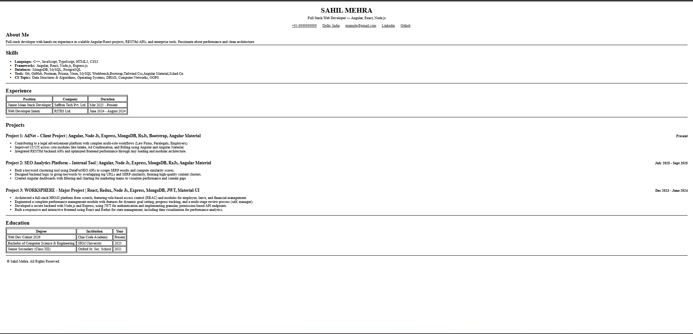

# 📄 Resume Webpage

A clean and professional resume webpage built using semantic HTML and structured layout principles.  
This project focuses on accessibility, readability, and proper document structure.

---

## 🚀 Live Demo

🔗 https://github.com/sahilmehra2003/html-resume-page.git

---

## 📸 Screenshots

### 🔹 Header

### 🔹 Projects Section

### 🔹 Full Page

*(Add images inside a `screenshots` folder)*

---

## ✨ Features

- Semantic HTML structure
- Clean and professional layout
- ATS-friendly resume structure
- Accessible content organization
- Easy to read & scan
- Responsive design (if implemented)

---

## 🛠 Technologies Used

- HTML5  
- CSS3  

---

## 📂 Project Structure
resume-website/
│
├── index.html
├── styles.css
├── screenshots/
│ ├── header.png
│ ├── projects.png
│ └── fullpage.png
└── README.md

---

## ⚙️ Setup & Usage

1️⃣ Clone the repository

2️⃣ Open the project folder
3️⃣ Open `index.html` in your browser.

## 🌐 Deployment (GitHub Pages)

This project is deployed using **GitHub Pages**.